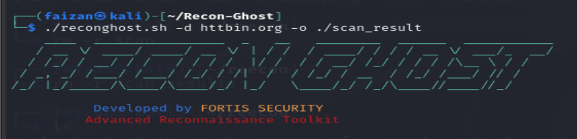
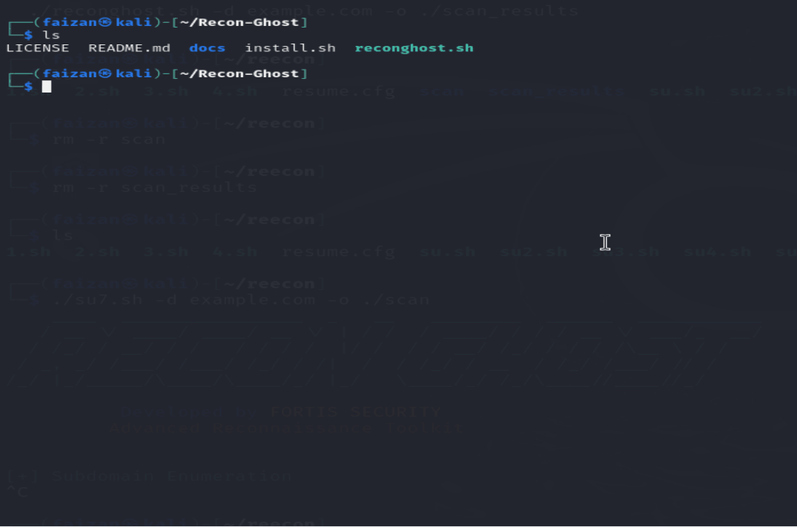

# RECON-GHOST
A powerful Bash-based automated reconnaissance toolkit for bug bounty hunters and penetration testers. Includes subdomain enumeration, port scanning, live host detection, fuzzing, and more. 🔍


# 🔍 RECON GHOST  

**Enterprise-Grade Reconnaissance Toolkit**  
*Developed by [FORTIS SECURITY]*  



---

## 📸 Screenshot


---

## ⚙️ Features
- 🛰️ Subdomain Enumeration (Amass + Subfinder)
- 🔍 Live Host Detection (httpx)
- 🔌 Port Scanning (Nmap)
- 📂 Web Path Fuzzing (FFuF)
- 👁️ Visual Recon (Aquatone)
- 🛡️ Vulnerability Scanning (Nuclei)

---

## 🔗 Installation


# Clone the repository
```bash
git clone https://github.com/yourusername/RECON-GHOST.git
```

# Make scripts executable
```bash
cd RECON-GHOST
chmod +x install.sh reconghost.sh
```

# Run the installer
```bash
./install.sh  # Installs all tools automatically
```

🛠 Usage
```bash
./reconghost.sh -d example.com -o ./scan_results [-w wordlist.txt]
```


## ⚐  Command Flags

| Flag | Description          | Required |
|------|----------------------|----------|
| `-d` | Target domain        | ✔ Yes    |
| `-o` | Output directory     | ✔ Yes    |
| `-w` | Custom wordlist path | No       |
| `-h` | Show help            | No       |
| `-v` | Show version         | No       |

> ℹ️ Default wordlist is used if `-w` is not specified.  


🔇 Silence output:
```bash
./reconghost.sh -d example.com -o ./scan_results [-w wordlist.txt] > /dev/null 2>&1
```


📂 Output File Structure
When the scan completes, the following directory structure is generated:

```
scan_results/
├── subdomains.txt
├── live_hosts.txt
├── ports.txt
├── fuzzing.txt
├── screenshots/
└── nuclei_results.txt
💡 This helps you organize recon data and import it into reporting tools easily.
```


📄 License
> This project is licensed under the MIT License.


🤝 Contribute
> Feel free to fork, star, and send PRs.
> Let’s build a powerful recon community together! 
